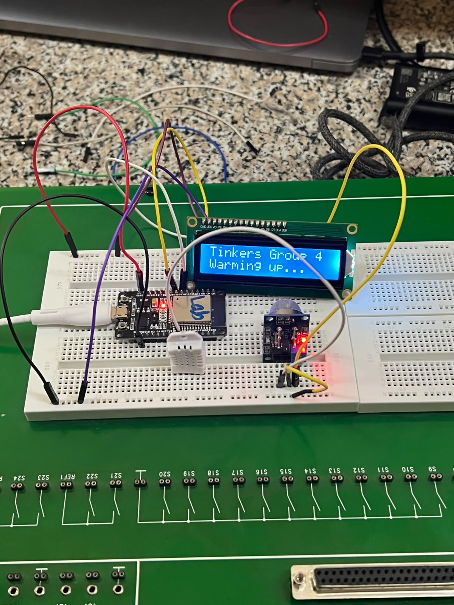
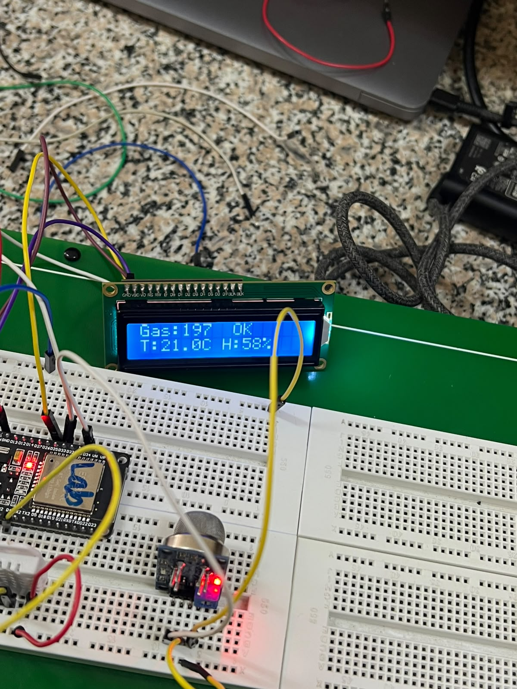
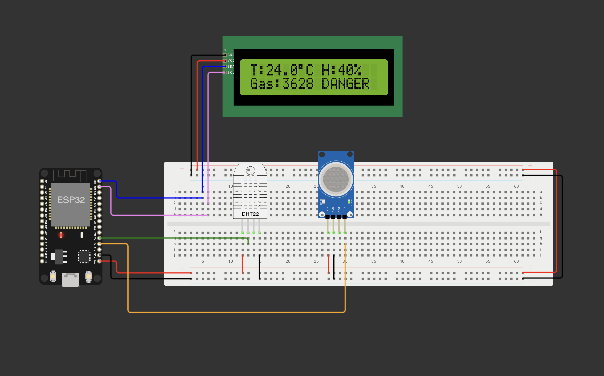
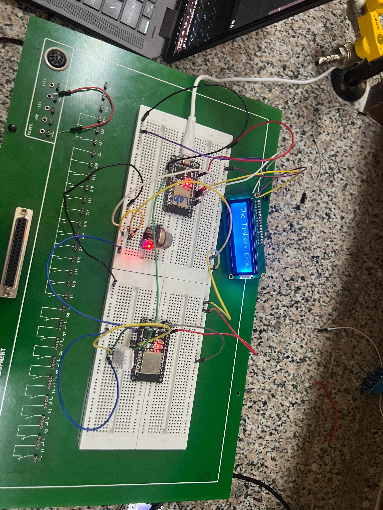
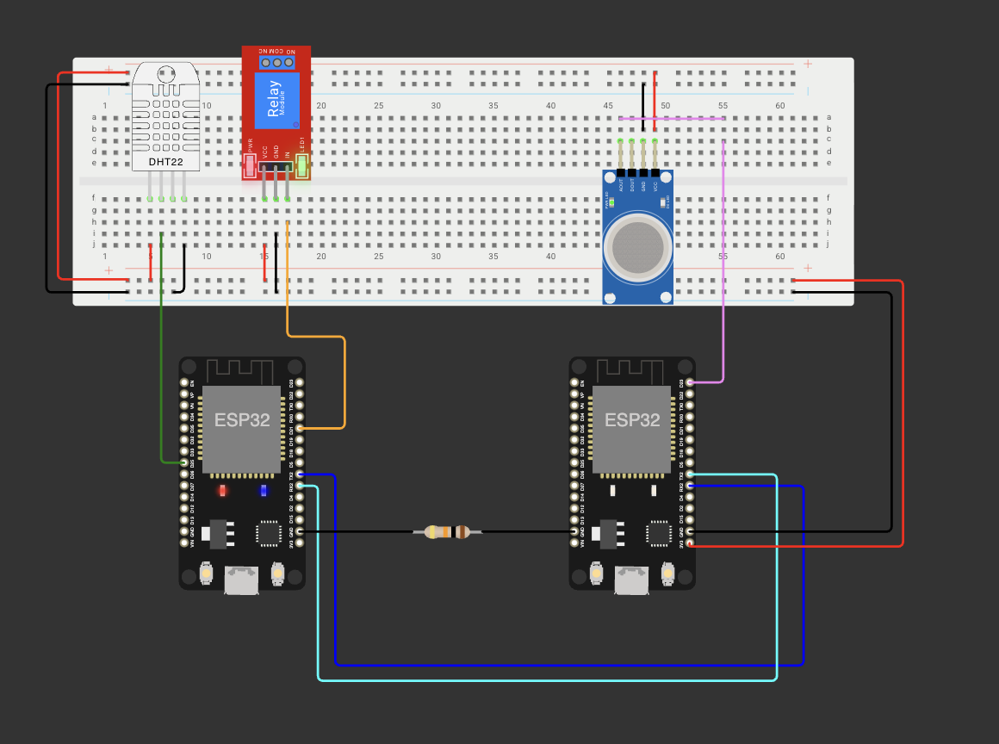
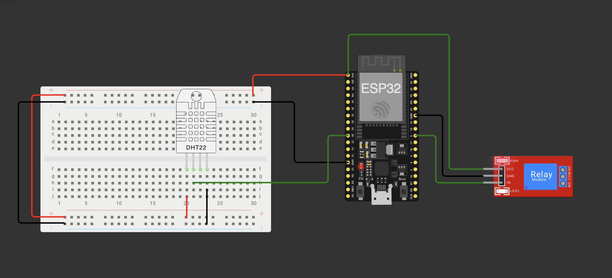
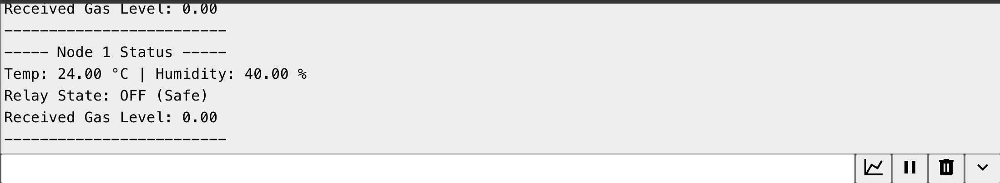
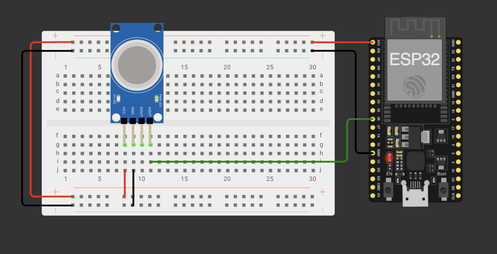
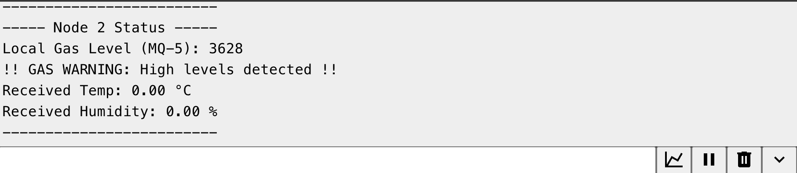

# ICS 4111: Embedded Systems & IoT
## Semester Project — Deliverable 2


**Group 4 — The Tinkers**

| No. | Student No. | Name                     |
| --- | ----------- | ------------------------ |
| 1   | 166263      | Waruhiu Jeremy Kang'ethe |
| 2   | 166390      | Muthii Eric Macharia     |
| 3   | 168656      | Deborah Rehana           |
| 4   | 166914      | Murega Kelvin Mutwiri    |
| 5   | 161492      | Sayialel Eric Lenina     |
| 6   | 167144      | Andrew Karanja Gathirwa  |

---


## Table of Contents

1. [Overview](#overview)
2. [Architecture A — Physical Prototype](#architecture-a--physical-prototype)
3. [Architecture A — Simulation](#architecture-a--simulation)
4. [Architecture B — Physical Prototype](#architecture-b--physical-prototype)
5. [Architecture C — Simulation](#architecture-c--simulation)
6. [Evidence of Group Work](#evidence-of-group-work)

---

## Overview

This deliverable presents four embedded system prototypes built from the schematics designed in Deliverable 1. The four prototypes are:

| # | Architecture | Mode |
|---|---|---|
| A | ESP32 + MQ-5 + DHT22 + LCD 1602 (I2C) | Physical + Simulation |
| B | ESP32 (MQ-5) ↔ ESP32 (DHT22) via direct interface | Physical |
| C | ESP32 (DHT22 + Relay) ↔ ESP32 (MQ-5) | Simulation |

> **Note on B/C interchangeability:** A physical prototype was developed for Architecture B; therefore, a simulation was developed for Architecture C — satisfying the requirement of at least 2 physical and 2 simulated prototypes.

---

## Architecture A — Physical Prototype

**Configuration:** 1× ESP32S · 1× MQ-5 · 1× DHT22 · 1× LCD 1602 (I2C)

### Schematic / Wiring

| Component | ESP32 Pin | Notes |
|---|---|---|
| DHT22 DATA | GPIO 4 | 10 kΩ pull-up resistor to 3.3 V |
| MQ-5 AO | GPIO 34 | Voltage divider (10 kΩ + 10 kΩ) |
| MQ-5 DO | GPIO 35 | Digital threshold output |
| LCD SDA | GPIO 21 | I2C bus |
| LCD SCL | GPIO 22 | I2C bus |

### Physical Prototype Images

**Breadboard / Circuit Assembly**




**LCD Output**




**IDE / Serial Monitor Output**


> *Replace with a screenshot of your Arduino IDE Serial Monitor showing sensor readings.*

### Observations

- The DHT22 reported stable temperature and humidity readings after a 2-second warm-up.
- The MQ-5 sensor required a ~60-second pre-heat period before gas readings stabilised.
- The LCD updated every 2 seconds displaying temperature (row 0) and gas status (row 1).
- A 10 kΩ pull-up resistor on the DHT22 data line resolved intermittent read failures.

---

## Architecture A — Simulation

**Wokwi Project Link:** [https://wokwi.com/projects/468340856334884865](https://wokwi.com/projects/468340856334884865)

> The MQ-5 is replaced with the MQ-2 gas sensor since the MQ-5 is not available.

### Simulation Files

```
sim_a/
├── sketch.ino      ← Main Arduino sketch
├── diagram.json    ← Wokwi circuit diagram
└── wokwi.toml      ← Library dependencies
```

### Simulation Screenshot




### Key Code Logic (Architecture A)

```cpp
// Read sensors
float temp   = dht.readTemperature();
float hum    = dht.readHumidity();
int   gasRaw = analogRead(MQ5_PIN);

// Determine gas status
String gasLabel;
if (gasRaw >= 2800)      gasLabel = "DANGER";
else if (gasRaw >= 1500) gasLabel = "WARNING";
else                     gasLabel = "NORMAL";

// LCD Row 0: T:27.4°C H:65%
lcd.setCursor(0, 0);
lcd.print("T:"); lcd.print(temp, 1);
lcd.print((char)223);           // ° symbol
lcd.print("C H:"); lcd.print((int)hum); lcd.print("%");

// LCD Row 1: Gas:1024 NORMAL
lcd.setCursor(0, 1);
lcd.print("Gas:"); lcd.print(gasRaw);
lcd.print(" "); lcd.print(gasLabel);
```

---

## Architecture B — Physical Prototype

**Configuration:** 1× ESP32S (MQ-5) directly interfaced with 1× ESP32S (DHT22) via UART

### Schematic / Wiring

**ESP32 Node 1 — MQ-5 Sensor**

| Component | ESP32 #1 Pin | Notes |
|---|---|---|
| MQ-5 AO | GPIO 34 | Voltage divider resistors |
| UART TX | GPIO 17 | → ESP32 #2 GPIO 16 |
| UART RX | GPIO 16 | ← ESP32 #2 GPIO 17 |

**ESP32 Node 2 — DHT22 Sensor**

| Component | ESP32 #2 Pin | Notes |
|---|---|---|
| DHT22 DATA | GPIO 4 | 10 kΩ pull-up resistor |
| UART TX | GPIO 17 | → ESP32 #1 GPIO 16 |
| UART RX | GPIO 16 | ← ESP32 #1 GPIO 17 |

### Physical Prototype Images

**Full Assembly — Both ESP32 Nodes**




### Observations

- UART2 (GPIO 16/17) was used for inter-ESP32 communication at 9600 baud.
- Node 2 (DHT22) transmitted sensor readings every 2 seconds; Node 1 (MQ-5) echoed gas status back.
- Both nodes displayed received data from the other node on their respective Serial monitors.
- A common GND between the two ESP32 boards was essential for stable UART communication.

---

## Architecture C — Simulation

**Configuration:** 1× ESP32 (DHT22 + Relay) ↔ 1× ESP32 (MQ-5) via UART

**Wokwi Project Link — Both nodes combined:** [https://wokwi.com/projects/468156423093139457](https://wokwi.com/projects/468156423093139457)

**Wokwi Project Link — Node 1 (DHT22 + Relay):** [https://wokwi.com/projects/468344811070287873](hhttps://wokwi.com/projects/468344811070287873)

**Wokwi Project Link — Node 2 (MQ-5):** [https://wokwi.com/projects/468345066554806273](https://wokwi.com/projects/468345066554806273)

> **Multi-MCU Note:** Wokwi's web editor supports a single active firmware per project. Architecture C is therefore submitted as two linked Wokwi projects (one per node) that form a complete system. But we have included a wokwi diagram that shows the uart connection even if the code does not run.

### System Diagram (Logical)

```
┌─────────────────────┐          UART2 (9600 baud)           ┌─────────────────────┐
│  ESP32 NODE 1       │ ◄──────────────────────────────────► |  ESP32 NODE 2       │
│                     │  TX(GPIO17) ──► RX(GPIO16)           │                     │
│  ● DHT22 → GPIO4    | RX(GPIO16) ◄── TX(GPIO17)            | ● MQ-5 → GPIO34     |
│  ● Relay → GPIO26   |                                      |                     │
└─────────────────────┘                                      └─────────────────────┘
         │
    Relay NO ──► ESP32 #2 EN pin  (relay can power-cycle Node 2)
```


### Relay Activation Logic (Node 1)

| Condition | Relay State | Meaning |
|---|---|---|
| Temp < 30°C AND Humidity < 75% | OFF | Environment is safe |
| Temp ≥ 30°C OR Humidity ≥ 75% | ON | Climate threshold exceeded |
| Relay ON + Gas DANGER | ON + Alert | Critical condition |

### Simulation Screenshots

**Node 1 — Wokwi Project Both ESPs connected via UART**




**Node 1 — Wokwi Project (DHT22 + Relay)**




**Node 1 — Serial Monitor Output**




**Node 2 — Wokwi Project (MQ-5)**




**Node 2 — Serial Monitor Output**




### Key Code Logic (Architecture C)

**Node 1 — Relay control + UART exchange**
```cpp
// Relay triggers on temperature OR humidity exceeding thresholds
bool relayOn = (temp >= TEMP_RELAY_ON || hum >= HUM_RELAY_ON);
digitalWrite(RELAY_PIN, relayOn ? HIGH : LOW);

// Send DHT reading to Node 2
Serial2.print("DHT:"); Serial2.print(temp, 1);
Serial2.print(',');    Serial2.println(hum, 1);

// Receive gas reading from Node 2
if (Serial2.available()) {
  String msg = Serial2.readStringUntil('\n');
  if (msg.startsWith("GAS:")) {
    gasRaw = msg.substring(4).toFloat();
  }
}
```

**Node 2 — Gas sensor + UART exchange**
```cpp
int rawGas = analogRead(MQ5_PIN);

// Transmit gas value to Node 1
Serial2.print("GAS:"); Serial2.println(rawGas);

// Receive DHT data from Node 1
if (Serial2.available()) {
  String msg = Serial2.readStringUntil('\n');
  if (msg.startsWith("DHT:")) { /* parse temp, hum */ }
}
```

---

## Evidence of Group Work


### Group Meeting / Collaboration Evidence


## Libraries Used

| Library | Version | Purpose |
|---|---|---|
| DHT sensor library (Adafruit) | 1.4.4 | Read DHT22 temperature & humidity |
| Adafruit Unified Sensor | 1.1.9 | Dependency for DHT library |
| LiquidCrystal I2C | 1.1.2 | Drive 16×2 LCD over I2C |
| Wire _(built-in)_ | — | I2C communication |

---

## References

- Espressif Systems. (2024). *ESP32 Technical Reference Manual*. https://www.espressif.com/en/support/documents/technical-documents
- Adafruit. (2024). *DHT22 Sensor Tutorial*. https://learn.adafruit.com/dht
- Wokwi. (2024). *Wokwi Simulator Documentation*. https://docs.wokwi.com
- Zhengzhou Winsen Electronics. *MQ-5 Gas Sensor Datasheet*. https://www.winsen-sensor.com

---

*ICS 4111 — Embedded Systems & IoT | Deliverable 2 | April–July 2026*
